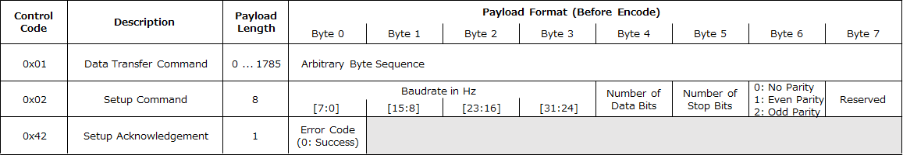

# UoM: UART over MIDI

## Overview

A protocol for transferring arbitrary byte sequences using MIDI.

## Protocol

### Basic Packet Format

### Payload Encoding

### Control Code Definition and Payload Format

### Error Codes

|Code|Mnemonic|Description|
|:--:|:--|:--|
|0|UOM_OK|No Error|
|1|UOM_ERR_MIDI_RX_BUFF_OVFL|MIDI Message Too Long|
|2|UOM_ERR_MIDI_INVALID_MSG|Invalid MIDI Message|
|3|UOM_ERR_INVALID_MARKER|Invalid UoM Marker|
|4|UOM_ERR_SYNTAX|Invalid UoM Packet Format|
|5|UOM_ERR_INVALID_PARAM|Invalid Parameter|
|6|UOM_ERR_INVALID_CTL_CODE|Unknown Control Code|
|7|UOM_ERR_NO_FUNCTION|Function Not Supported|

----